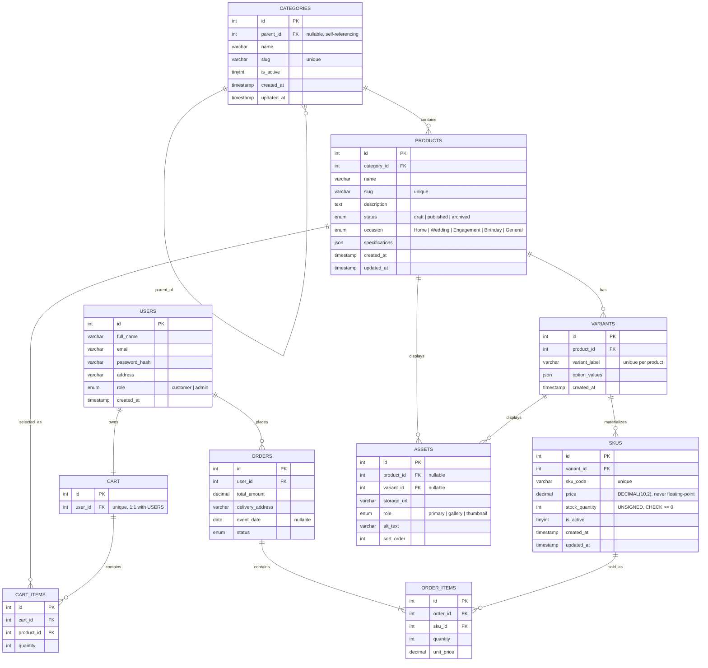

# Sprint 2: Catalog Data Foundation

**Project:** NestDecor — Home & Event Decor Store
**Course:** E-Commerce

---

## 1. Sprint Goal and Scope Boundary

**Goal:** Given a product catalog administrator, the system persists categories, products, variants, and SKUs without losing identity, relationship, price, or inventory meaning.

**In scope (delivered this sprint):** category tree management, product create/edit with status, variants and SKUs with unique codes/price/stock, authenticated admin CRUD, database constraints, migrations/schema, seed data, and automated tests.

**Out of scope (deferred to Sprint 3):** dynamic specification validation beyond a JSON column, asset file upload (only a `storage_url` field exists — no upload endpoint yet), public catalog search, publication workflows beyond a simple status field, payment integration, and the shopper-facing checkout flow.

---

## 2. Link to Sprint 1 Decisions

This sprint **extends** the Sprint 1 ERD rather than replacing it:
- The Sprint 1 tech stack is unchanged: PHP + MySQL + Bootstrap/vanilla JS (see `docs/SPRINT_1.md`, Section 3).
- The Sprint 1 `users`, `cart`, `cart_items`, `orders`, and `order_items` tables are kept. `users` gains a `role` column (`customer`/`admin`) to support CAT06 admin authentication, which Sprint 1 had not yet needed.
- The flat Sprint 1 `products` table is replaced by the `categories → products → variants → skus` model required by this sprint. `cart_items` still references `products` (a shopper adds a product to their cart before choosing a variant); `order_items` now references `skus` instead of `products`, since a SKU is the exact priced, stocked unit that was actually purchased.

---

## 3. Updated ERD and Data Dictionary



### Cardinality and Delete/Update Policy

| Relationship | Cardinality | On Delete | On Update |
|---|---|---|---|
| CATEGORIES → CATEGORIES (parent) | 1:N | SET NULL | CASCADE |
| CATEGORIES → PRODUCTS | 1:N | RESTRICT | CASCADE |
| PRODUCTS → VARIANTS | 1:N | CASCADE | CASCADE |
| VARIANTS → SKUS | 1:N | CASCADE | CASCADE |
| PRODUCTS / VARIANTS → ASSETS | 1:N each | CASCADE | CASCADE |
| USERS → CART | 1:1 | CASCADE | CASCADE |
| CART → CART_ITEMS | 1:N | CASCADE | CASCADE |
| PRODUCTS → CART_ITEMS | 1:N | CASCADE | CASCADE |
| USERS → ORDERS | 1:N | RESTRICT | CASCADE |
| ORDERS → ORDER_ITEMS | 1:N | CASCADE | CASCADE |
| SKUS → ORDER_ITEMS | 1:N | RESTRICT | CASCADE |

`ORDER_ITEMS` is the associative entity resolving the underlying N:M relationship between `ORDERS` and `SKUS`. A SKU is `RESTRICT`-protected from deletion once it has been ordered, so historical order records never lose their pricing reference (see Q7 below).

**Money representation:** `price` and `unit_price` use `DECIMAL(10,2)` — an exact fixed-point type — never `FLOAT`/`DOUBLE`, avoiding floating-point rounding errors in currency math.

**Stock representation:** `stock_quantity` is `INT UNSIGNED` with a `CHECK (stock_quantity >= 0)` constraint at the database level, enforced in addition to application-level validation in `SkuService.php`.

---

## 4. Administration API Routes

All routes require an authenticated session with `role = admin` (see Section 5). Base path: `/nestdecor/api/v1/admin`.

| Method | Route | Purpose |
|---|---|---|
| GET | `/categories` | List the full category tree |
| GET | `/categories/:id` | Get a single category |
| POST | `/categories` | Create a category |
| PATCH | `/categories/:id` | Rename, move, or activate/deactivate a category |
| GET | `/products` | List all products (admin view, includes drafts) |
| GET | `/products/:id` | Get a product with its variants and SKUs nested |
| POST | `/products` | Create a draft product |
| PATCH | `/products/:id` | Update product content or status |
| POST | `/products/:id/skus` | Add a SKU (creates the variant too, if new) |
| PATCH | `/skus/:id` | Update a SKU's price, stock, or active status |

### Example: Create a Category
**Request**
```http
POST /api/v1/admin/categories
Content-Type: application/json

{ "name": "Birthday Decor" }
```
**Response — 201 Created**
```json
{ "id": 4, "parent_id": null, "name": "Birthday Decor", "slug": "birthday-decor", "is_active": 1 }
```
**Response — 409 Conflict** (slug already exists)
```json
{ "error": "A category with slug 'birthday-decor' already exists." }
```

### Example: Add a SKU to a Product
**Request**
```http
POST /api/v1/admin/products/1/skus
Content-Type: application/json

{
  "sku_code": "BACKDROP-WHITE-001",
  "price": 8800,
  "stock_quantity": 6,
  "variant_label": "Color: White",
  "option_values": { "color": "White" }
}
```
**Response — 201 Created**
```json
{ "id": 5, "variant_id": 3, "sku_code": "BACKDROP-WHITE-001", "price": 8800, "stock_quantity": 6 }
```
**Response — 401 Unauthorized** (no session)
```json
{ "error": "Unauthenticated. Please log in." }
```

*(Run these against your own local server after setup — see README — and paste the actual response you get here, redacting nothing sensitive is needed since this is local-only test data.)*

---

## 5. Data Integrity and Authorization Decisions

- **Authentication/Authorization (CAT06):** every admin endpoint calls `require_admin_api()`, which checks `$_SESSION['user_id']` and `$_SESSION['role'] === 'admin'` before any database access, returning `401` (not logged in) or `403` (logged in but not admin) otherwise. The underlying decision logic (`checkAdminAuthorization()`) is a pure function so it is unit-testable without a real HTTP request (see `tests/AuthorizationTest.php`).
- **Database-level integrity (CAT05):** uniqueness (`slug`, `sku_code`) and foreign keys are enforced by MySQL itself, not only by PHP validation — so even a bug in application code cannot silently corrupt referential integrity or create a duplicate.
- **Duplicate slugs/SKU codes** return `409 Conflict` with a descriptive message rather than a raw database error/stack trace.

### Business Rules (Required Q&A)

1. **Can a draft product have no SKU? Can a published product have no sellable SKU?**
   A draft product can have zero SKUs — it is not yet customer-facing. A published product cannot: `ProductService::updateProduct()` blocks a transition to `published` unless at least one active SKU exists (tested in `testProductCannotBePublishedWithoutAnActiveSku`).

2. **Is a product assigned to one canonical category, many categories, or both?**
   One canonical category (`products.category_id` is a single required foreign key). This was chosen for simplicity and because the storefront navigation (Home / Wedding / Engagement / Birthday) maps cleanly to one category per product; multi-category tagging was judged unnecessary scope for this sprint.

3. **What happens when a parent category is deactivated?**
   Deactivating a category only sets its own `is_active = 0`; child categories are untouched at the database level. The admin UI (Sprint 3) is expected to visually flag orphaned-looking active children, but the schema intentionally does not cascade deactivation automatically, since a sub-category may still be independently valid.

4. **How is an out-of-stock SKU represented in a public response?**
   The SKU row still exists (`stock_quantity = 0`), and `is_active` remains `1` unless an admin explicitly deactivates it. A future public read endpoint (Sprint 3) is expected to show it as "Out of Stock" rather than hiding it, since hiding it would lose catalog history and re-stock ability.

5. **Can two SKUs share a price? Can a SKU have a price override?**
   Yes to both — `price` has no uniqueness constraint, so two SKUs (even across different products) can share a price, and any SKU's price can be changed independently at any time via `PATCH /skus/:id`.

6. **What prevents negative stock and duplicate SKU codes?**
   Both are enforced twice: in `SkuService.php` (returns a clean `422`/`409` error) and again at the database level (`CHECK (stock_quantity >= 0)` and `UNIQUE (sku_code)`), so integrity holds even if application code is bypassed.

7. **What happens to a product referenced by a future cart or order after it is deactivated?**
   `order_items.sku_id` uses `ON DELETE RESTRICT`, so a SKU that has ever been ordered cannot be deleted at all — it can only be deactivated (`is_active = 0`), keeping historical orders intact with correct pricing. `cart_items.product_id` uses `ON DELETE CASCADE` since an abandoned cart referencing a deleted product is not historically important data.

---

## 6. Seed Data and Demonstration

Run `database/schema.sql` then `database/seed.sql` (see README). This creates:
- 3 categories across 2 levels (`Wedding & Engagement Decor` → child `Stage Decor`; `Home Decor` top-level)
- 3 products, one with multiple variants (`Floral Stage Backdrop`: Red, Gold, White)
- 4 SKUs (Red and Gold backdrop, fairy lights, rings tray)
- 1 intentionally unavailable combination (`Color: White` variant exists with **no SKU** — demonstrating CAT04: we never fake a zero-stock SKU for a combination nobody has priced yet)
- 1 admin account and 1 customer account for testing login/authorization

**To demonstrate:** log in at `/admin/login.php` with the admin account, then call `GET /api/v1/admin/products` and `GET /api/v1/admin/categories` to retrieve the seeded records through the same API a real admin UI would use.

---

## 7. Test Strategy, Command, and Result

**Strategy:** automated PHPUnit tests exercise the service layer (`CategoryService`, `ProductService`, `SkuService`) directly against a dedicated `nestdecor_test` database, with every test wrapped in a transaction that is rolled back afterward for isolation. Authorization logic is tested as a pure function so no HTTP server is required to verify it.

**Coverage:**
- Category creation, duplicate slug rejection (`409`), cycle prevention, deactivation
- Product creation with required fields, duplicate slug rejection, publish-without-SKU rejection
- SKU creation with required fields, duplicate SKU code rejection, negative stock rejection (on create and on update)
- A variant with no SKU is confirmed to never be faked as a zero-stock SKU
- Authorization: unauthenticated, forbidden (non-admin), and authorized (admin) session states

**Command to run:**
```bash
composer install
vendor/bin/phpunit
```

**Result:** `OK (22 tests, 27 assertions)`

---

## 8. Known Limitations and Sprint 3 Backlog

- `assets.storage_url` is a plain string field — there is no file upload endpoint yet; Sprint 3 must add image upload handling.
- `specifications` is an unvalidated JSON column — Sprint 3 should add a validation schema per category (e.g. required keys for "Lighting" vs "Stage Decor").
- No public (customer-facing) catalog read endpoints exist yet — everything built this sprint is admin-only.
- No publication workflow beyond a raw `status` enum — no scheduled publishing, no review step.
- Cart-to-SKU resolution (choosing a specific variant/SKU when adding to cart) is not yet implemented; `cart_items` still only stores `product_id`.

Sprint 3 should build directly on the `products`, `variants`, and `skus` tables and their identities established here, rather than duplicating product or pricing logic.
