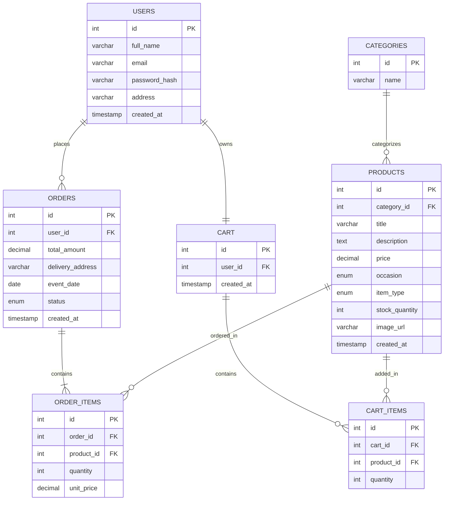

# Sprint 1: System Architecture & Scope Definition

**Project:** NestDecor — Home & Event Decor Store
**Course:** E-Commerce

---

## Section 1: Target Audience & Market Focus

**Primary Persona:** Two overlapping customer groups — (1) homeowners looking to decorate everyday living spaces, and (2) individuals/families organizing weddings, engagements, or birthday functions who need decoration items on a deadline tied to an event date.

**Core Pain Point:** Decoration shopping in Pakistan is fragmented across multiple specialty vendors — one shop for lighting, another for stage/wedding decor, another for party supplies. Buyers, especially those planning a one-time event, have no single platform to browse by occasion, compare pre-built decor packages, and schedule delivery around a fixed event date.

**Domain Scope:** Consumer retail e-commerce in the Home & Event Decor vertical, covering four occasion-based product lines: Home Decor, Wedding & Engagement Decor, Birthday & Party Decor, and pre-designed Event Packages (bundled decor sets).

---

## Section 2: MVP Feature Scope Matrix

| Category | Feature Name | Description | Priority |
|---|---|---|---|
| Authentication | User Registration & Authentication | Password hashing and session-based authentication for customer accounts. | High (MVP) |
| Catalog | Product List & Occasion Filter | Product browsing interface with category and occasion-based filtering (Home, Wedding, Engagement, Birthday). | High (MVP) |
| Cart | Cart Management | State-persistent cart management (item addition, quantity modification, and deletion). | High (MVP) |
| Checkout | Order Processing | Mock checkout flow (Cash on Delivery) capturing delivery address and a required event date for scheduling. | High (MVP) |
| Catalog | Event Package Bundles | Pre-defined decor bundles (e.g., "Complete Mangni Set") listed and purchased as a single catalog item. | Medium |
| Admin | Inventory Control | Administrative CRUD operations for products, packages, and category management. | Medium |

---

## Section 3: Tech Stack Selection & Justification

- **Frontend Framework:** HTML5, CSS3, Bootstrap 5, vanilla JavaScript
  *Justification:* The site is catalog- and form-driven (browsing, filtering, checkout) rather than state-heavy, so a component framework like React would add unnecessary build tooling. Bootstrap's grid system supports the image-heavy product/package listings within the semester timeline.

- **Backend Infrastructure:** PHP (procedural/OOP) on Apache
  *Justification:* PHP's native session handling directly supports cart persistence and authentication without external libraries. Its minimal setup (via XAMPP) reduces environment-configuration risk compared to Node.js/Express or Django, matching the team's existing familiarity with the language.

- **Database Management System:** MySQL
  *Justification:* The domain is strictly relational — products, categories, packages, carts, and orders resolve to well-defined foreign-key relationships. MySQL's transactional support ensures order integrity, which a non-relational store like MongoDB would not enforce as naturally for this fixed schema.

- **Caching & Asynchronous Processing:** Not implemented in MVP
  *Justification:* Given the expected scale (single-store catalog, low concurrent traffic), native PHP sessions handle cart state adequately. Redis/Celery would add operational complexity disproportionate to the project's academic scope.

---

## Section 4: Entity-Relationship Diagram (ERD)

**Attribute Notes:**
- `PRODUCTS.occasion`: ENUM('Home', 'Wedding', 'Engagement', 'Birthday', 'General') — drives the occasion filter on the catalog page.
- `PRODUCTS.item_type`: ENUM('Single Item', 'Package') — lets pre-designed event bundles (e.g., "Complete Mangni Set") live in the same table and flow through the same cart/checkout logic as regular products, avoiding a separate bundle-management system.
- `ORDERS.event_date`: nullable DATE — captured at checkout so wedding/engagement/birthday orders can be scheduled for delivery ahead of the function; left null for regular home-decor orders.

**Relationship & Cardinality Notes:**
- `USERS` to `ORDERS`: 1:N — a customer can place multiple orders over time.
- `USERS` to `CART`: 1:1 — each user has exactly one active cart.
- `CATEGORIES` to `PRODUCTS`: 1:N — one category (e.g., "Lighting") groups many products.
- `CART` to `CART_ITEMS`: 1:N — a cart holds multiple product entries.
- `PRODUCTS` to `CART_ITEMS`: 1:N — a product may sit in multiple users' carts simultaneously.
- `ORDERS` to `ORDER_ITEMS`: 1:N (minimum 1) — every order must contain at least one item.
- `PRODUCTS` to `ORDER_ITEMS`: 1:N — `ORDER_ITEMS` is the associative entity resolving the underlying N:M relationship between `ORDERS` and `PRODUCTS`.
